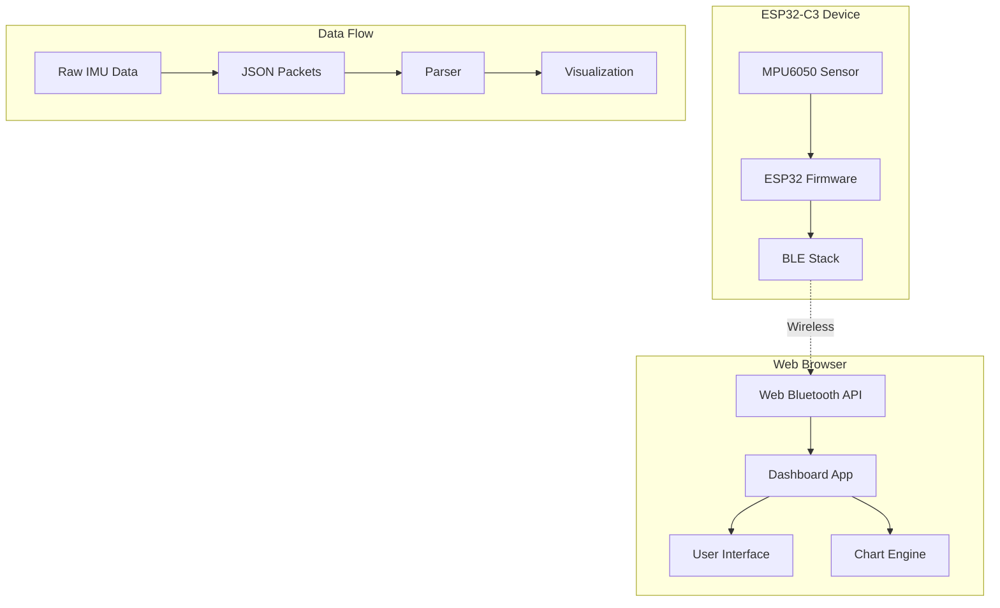

# Design Document

## Overview

The Web Bluetooth IMU Dashboard is a dual-component system consisting of ESP32-C3 firmware and a web application that work together to provide real-time IMU sensor visualization. The ESP32 firmware reads data from an MPU6050 sensor and transmits it via Bluetooth Low Energy, while the web dashboard receives this data and presents it through live charts and numerical displays.

The system architecture emphasizes real-time performance, handling data streams at 50-100 Hz with minimal latency. The design uses vanilla web technologies for maximum compatibility and follows established BLE communication patterns for reliable wireless data transmission.

## Architecture

### System Components



### Communication Protocol

The system uses a Nordic UART Service (NUS) compatible BLE profile:
- **Service UUID**: `6E400001-B5A3-F393-E0A9-E50E24DCCA9E`
- **TX Characteristic**: `6E400003-B5A3-F393-E0A9-E50E24DCCA9E` (Notify)
- **Data Format**: JSON strings containing IMU measurements

### Performance Requirements

- **Update Rate**: 50-100 Hz for smooth real-time visualization
- **Latency**: < 50ms from sensor reading to chart update
- **Data Throughput**: ~200-400 bytes/second (JSON packets)
- **Browser Compatibility**: Chrome/Edge with Web Bluetooth support

## Components and Interfaces

### ESP32 Firmware Components

#### MPU6050Interface
```cpp
class MPU6050Interface {
public:
    bool initialize(int sda_pin, int scl_pin);
    bool testConnection();
    void getMotion6(int16_t* ax, int16_t* ay, int16_t* az, 
                   int16_t* gx, int16_t* gy, int16_t* gz);
    void convertToUnits(int16_t raw, float& converted, float scale);
};
```

#### BLEManager
```cpp
class BLEManager {
public:
    bool initializeBLE(const char* device_name);
    void setupService();
    void sendIMUData(const IMUData& data);
    bool isClientConnected();
private:
    BLEServer* server;
    BLECharacteristic* txCharacteristic;
};
```

#### IMUDataProcessor
```cpp
struct IMUData {
    unsigned long timestamp;
    float ax, ay, az;  // Accelerometer (g)
    float gx, gy, gz;  // Gyroscope (deg/s)
};

class IMUDataProcessor {
public:
    String formatAsJSON(const IMUData& data);
    void processRawData(int16_t raw_ax, int16_t raw_ay, int16_t raw_az,
                       int16_t raw_gx, int16_t raw_gy, int16_t raw_gz,
                       IMUData& output);
};
```

### Web Dashboard Components

#### BLEConnectionManager
```javascript
class BLEConnectionManager {
    constructor() {
        this.device = null;
        this.server = null;
        this.service = null;
        this.characteristic = null;
        this.isConnected = false;
    }
    
    async connect();
    async disconnect();
    onDataReceived(callback);
    getConnectionStatus();
}
```

#### IMUDataParser
```javascript
class IMUDataParser {
    parsePacket(uint8Array) {
        // Convert Uint8Array -> String -> JSON
        const text = new TextDecoder().decode(uint8Array);
        return JSON.parse(text);
    }
    
    validatePacket(data) {
        // Ensure required fields exist and are valid numbers
        return data.hasOwnProperty('t') && 
               data.hasOwnProperty('ax') && /* ... */;
    }
}
```

#### ChartManager
```javascript
class ChartManager {
    constructor(canvasId, maxDataPoints = 100) {
        this.chart = new Chart(canvasId, this.getChartConfig());
        this.maxDataPoints = maxDataPoints;
    }
    
    addDataPoint(timestamp, values);
    updateChart();
    clearData();
}
```

#### UIController
```javascript
class UIController {
    constructor() {
        this.connectionPanel = new ConnectionPanel();
        this.dataPanel = new LiveDataPanel();
        this.accelChart = new ChartManager('accel-chart');
        this.gyroChart = new ChartManager('gyro-chart');
    }
    
    updateConnectionStatus(status);
    updateLiveData(imuData);
    updateCharts(imuData);
    showError(message);
}
```

## Data Models

### IMU Packet Format
```json
{
    "t": 1234567890,    // Timestamp (milliseconds since boot)
    "ax": 0.12,         // Accelerometer X (g)
    "ay": -0.98,        // Accelerometer Y (g) 
    "az": 0.05,         // Accelerometer Z (g)
    "gx": 0.33,         // Gyroscope X (deg/s)
    "gy": -0.12,        // Gyroscope Y (deg/s)
    "gz": 0.40          // Gyroscope Z (deg/s)
}
```

### Sensor Calibration Constants
```cpp
// MPU6050 scale factors
const float ACCEL_SCALE = 16384.0;  // LSB/g for ±2g range
const float GYRO_SCALE = 131.0;     // LSB/(deg/s) for ±250deg/s range
```

### Chart Data Structure
```javascript
const chartData = {
    labels: [],  // Timestamps
    datasets: [
        {
            label: 'X-axis',
            data: [],
            borderColor: 'rgb(255, 99, 132)',
            tension: 0.1
        },
        // Y and Z axis datasets...
    ]
};
```

## Correctness Properties

*A property is a characteristic or behavior that should hold true across all valid executions of a system-essentially, a formal statement about what the system should do. Properties serve as the bridge between human-readable specifications and machine-verifiable correctness guarantees.*

### Property 1: Sensor data reading consistency
*For any* MPU6050 sensor reading operation, the returned accelerometer and gyroscope values should be within valid physical ranges (-32768 to 32767 for raw values)
**Validates: Requirements 1.4, 1.5**

### Property 2: JSON packet parsing round-trip
*For any* valid IMU packet JSON string, parsing the JSON and then re-serializing should produce equivalent data structures
**Validates: Requirements 3.1, 3.2, 3.3, 7.1**

### Property 3: Live data panel updates
*For any* received IMU packet, updating the live data panel should result in all six sensor values (ax, ay, az, gx, gy, gz) and timestamp being displayed correctly
**Validates: Requirements 3.4**

### Property 4: Chart data consistency
*For any* IMU packet received, adding the data to both accelerometer and gyroscope charts should result in the chart datasets containing the correct number of data points and values
**Validates: Requirements 4.1, 4.2**

### Property 5: Unit conversion accuracy
*For any* raw sensor reading from the MPU6050, converting to physical units using the scale factors should produce values within expected ranges (±2g for accelerometer, ±250°/s for gyroscope)
**Validates: Requirements 6.3**

### Property 6: JSON formatting completeness
*For any* IMU data structure, formatting as JSON should produce a string containing all required fields (t, ax, ay, az, gx, gy, gz) with correct data types
**Validates: Requirements 6.4**

### Property 7: High-frequency data integrity
*For any* sequence of rapidly received IMU packets, processing them should maintain correct ordering and not lose or corrupt any data values
**Validates: Requirements 7.5**

## Error Handling

### ESP32 Firmware Error Handling

#### Sensor Initialization Errors
- **I2C Communication Failure**: Retry initialization up to 3 times with increasing delays
- **MPU6050 Not Detected**: Log error to serial and enter safe mode with status LED indication
- **Sensor Reading Timeout**: Skip current reading cycle and continue with next iteration

#### BLE Communication Errors
- **BLE Stack Initialization Failure**: Restart ESP32 after logging error
- **Client Disconnection**: Continue sensor reading and attempt to advertise for new connections
- **Characteristic Write Failure**: Buffer data temporarily and retry transmission

#### Data Processing Errors
- **Invalid Sensor Readings**: Use previous valid reading or zero values with error flag
- **JSON Serialization Failure**: Log error and send error packet to client
- **Memory Allocation Failure**: Reduce update frequency and log warning

### Web Dashboard Error Handling

#### BLE Connection Errors
```javascript
class BLEErrorHandler {
    static handleConnectionError(error) {
        if (error.name === 'NotSupportedError') {
            return 'Web Bluetooth not supported in this browser';
        } else if (error.name === 'NotFoundError') {
            return 'No compatible devices found';
        } else if (error.name === 'SecurityError') {
            return 'Bluetooth access denied by user';
        }
        return `Connection failed: ${error.message}`;
    }
}
```

#### Data Processing Errors
- **JSON Parse Errors**: Log malformed packets and continue processing
- **Missing Data Fields**: Use default values and show warning indicator
- **Chart Update Failures**: Retry update on next animation frame

#### UI Error States
- **Connection Lost**: Show reconnection button and disable data displays
- **Performance Degradation**: Reduce chart update frequency automatically
- **Browser Compatibility**: Show fallback message with supported browser list

## Testing Strategy

### Dual Testing Approach

The system will use both unit testing and property-based testing to ensure comprehensive coverage:

- **Unit tests** verify specific examples, integration points, and edge cases
- **Property tests** verify universal properties across all valid inputs
- Together they provide complete coverage: unit tests catch concrete bugs, property tests verify general correctness

### Property-Based Testing Framework

**JavaScript (Web Dashboard)**: fast-check library
- Configure each property test to run minimum 100 iterations
- Tag each test with format: `**Feature: web-bluetooth-imu-dashboard, Property {number}: {property_text}**`

**C++ (ESP32 Firmware)**: Custom property testing using Arduino framework
- Generate random sensor values within valid ranges
- Test conversion functions and JSON formatting
- Validate BLE packet structure and content

### Unit Testing Strategy

#### ESP32 Firmware Unit Tests
- Sensor initialization and I2C communication
- Raw data conversion to physical units
- JSON packet formatting and structure
- BLE service and characteristic setup
- Error handling for hardware failures

#### Web Dashboard Unit Tests
- BLE connection establishment and management
- JSON packet parsing and validation
- Chart initialization and configuration
- UI component rendering and updates
- Error message display and handling

### Integration Testing

#### End-to-End Data Flow
- ESP32 sensor reading → BLE transmission → Web dashboard reception → Chart display
- Connection establishment and reconnection scenarios
- High-frequency data streaming performance
- Error recovery and graceful degradation

#### Cross-Browser Compatibility
- Chrome/Edge Web Bluetooth API compatibility
- Responsive design across different screen sizes
- Performance testing on various hardware configurations

### Performance Testing

#### Throughput Testing
- Verify 50-100 Hz data transmission rates
- Measure latency from sensor reading to chart update
- Test system behavior under sustained high-frequency operation

#### Memory and Resource Testing
- Monitor memory usage during extended operation
- Verify no memory leaks in chart data management
- Test performance degradation handling

## Implementation Notes

### ESP32 Development Environment
- **Platform**: Arduino IDE or PlatformIO
- **Board**: ESP32-C3 SuperMini
- **Libraries**: 
  - `MPU6050` by Electronic Cats
  - `ESP32 BLE Arduino` (built-in)
  - `ArduinoJson` for JSON formatting

### Web Development Environment
- **Technologies**: Vanilla HTML5, CSS3, ES6+ JavaScript
- **Chart Library**: Chart.js v3.x for real-time streaming charts
- **BLE API**: Web Bluetooth API (Chrome/Edge only)
- **Build Tools**: None required (vanilla implementation)

### Deployment Considerations
- **Web Hosting**: Any static file server (GitHub Pages, Netlify, local server)
- **HTTPS Requirement**: Web Bluetooth requires secure context (HTTPS)
- **Browser Support**: Chrome 56+, Edge 79+ (Web Bluetooth enabled)
- **ESP32 Programming**: USB-C connection for firmware upload