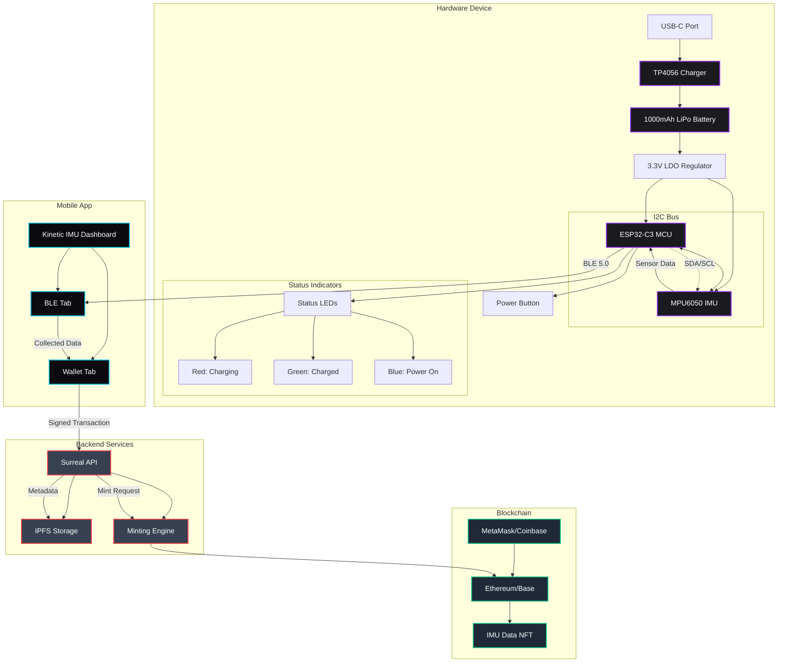
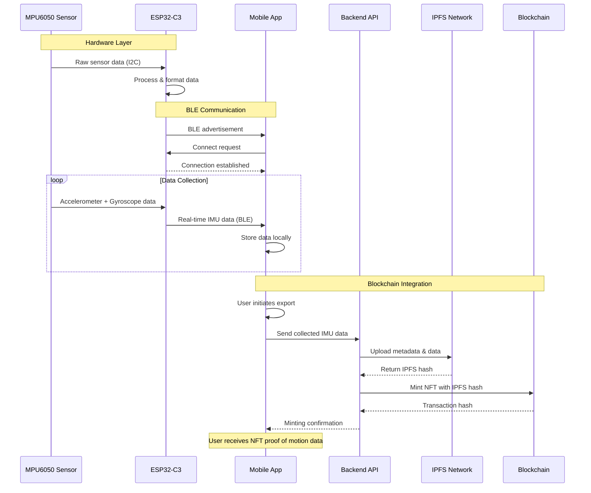
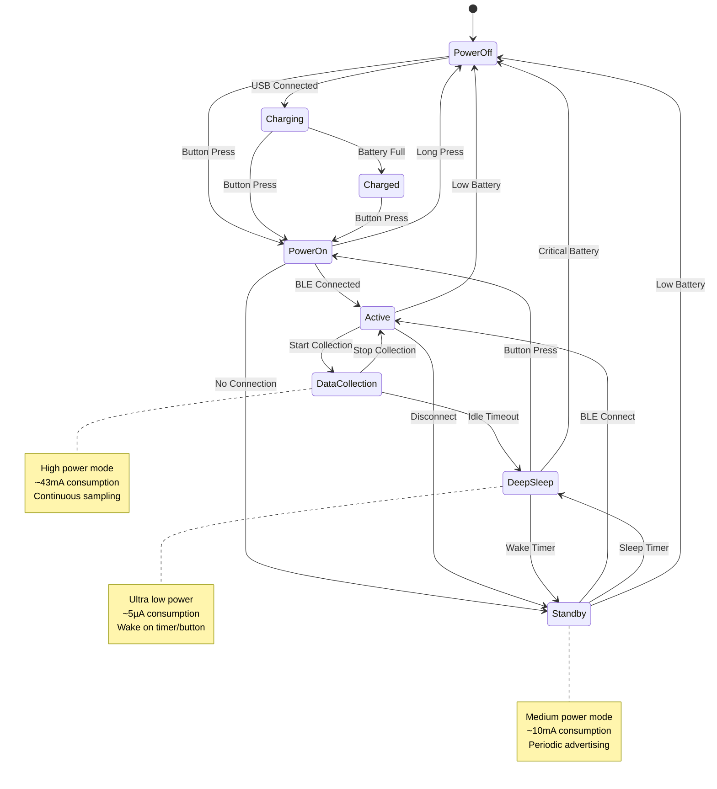

# Kinetic IMU Hardware Documentation

## Overview

The Kinetic IMU device is a compact, wireless motion sensing unit designed for real-time data collection and blockchain integration. It combines an ESP32-C3 microcontroller with a high-precision IMU sensor to capture and transmit motion data via Bluetooth Low Energy (BLE).

## System Architecture



## Data Flow Diagram



## Power Management Flow



## Hardware Components

### 1. ESP32-C3 Microcontroller

**Specifications:**
- **Chip**: ESP32-C3 (RISC-V single-core processor)
- **Clock Speed**: Up to 160 MHz
- **Flash Memory**: 4MB
- **RAM**: 400KB SRAM
- **Connectivity**: 
  - Wi-Fi 802.11 b/g/n (2.4 GHz)
  - Bluetooth 5.0 LE
- **GPIO Pins**: 22 programmable GPIOs
- **Operating Voltage**: 3.0V - 3.6V
- **Power Consumption**: 
  - Active mode: ~43mA
  - Deep sleep: ~5µA

**Key Features:**
- Built-in antenna for wireless communication
- Hardware security features (AES, SHA, RSA)
- Low power consumption ideal for battery operation
- Integrated USB-to-UART bridge for programming

### 2. IMU Sensor (MPU6050)

**Specifications:**
- **Type**: 6-axis Motion Processing Unit
- **Accelerometer**: 3-axis, ±2g/±4g/±8g/±16g selectable range
- **Gyroscope**: 3-axis, ±250°/s to ±2000°/s selectable range
- **Resolution**: 16-bit ADC for each channel
- **Communication**: I2C interface (400kHz max)
- **Operating Voltage**: 2.375V - 3.46V
- **Temperature Range**: -40°C to +85°C

**Data Output:**
- **Accelerometer Data**: X, Y, Z axis acceleration (m/s²)
- **Gyroscope Data**: X, Y, Z axis angular velocity (°/s)
- **Temperature**: Internal temperature sensor
- **Sample Rate**: Up to 1kHz configurable
- **Digital Motion Processor**: Built-in motion processing

### 3. Battery System

**Primary Battery:**
- **Type**: Lithium Polymer (LiPo)
- **Capacity**: 1000mAh
- **Voltage**: 3.7V nominal (4.2V max, 3.0V min)
- **Dimensions**: 50mm x 30mm x 8mm (approximate)
- **Connector**: JST-PH 2.0mm 2-pin

**Battery Life Estimates:**
- **Continuous BLE transmission**: ~8-12 hours
- **Periodic sampling (1Hz)**: ~24-48 hours
- **Deep sleep mode**: ~30+ days
- **Standby with occasional wake**: ~7-14 days

### 4. Charging System

**Charging IC**: TP4056 or similar Li-ion/LiPo charger
- **Input**: USB-C connector (5V)
- **Charging Current**: 500mA (configurable)
- **Charging Time**: ~2-3 hours (0% to 100%)
- **Protection Features**:
  - Overcharge protection (4.2V cutoff)
  - Over-discharge protection (3.0V cutoff)
  - Short circuit protection
  - Thermal protection

**Charging Indicators:**
- **Red LED**: Charging in progress
- **Green LED**: Charging complete
- **Blue LED**: Device powered on

## Physical Design

### Enclosure
- **Material**: ABS plastic or 3D printed PLA
- **Dimensions**: 60mm x 40mm x 15mm (approximate)
- **Weight**: ~45g including battery
- **Color**: Black with status LED windows
- **Mounting**: Clip or strap attachment points

### Port Layout
- **USB-C Port**: Bottom edge for charging
- **Power Button**: Side-mounted tactile switch
- **Reset Button**: Recessed button (requires pin to press)
- **Status LEDs**: Top face, visible through translucent windows

## Electrical Specifications

### Power Distribution
```
USB-C (5V) → Charging IC → Battery (3.7V) → LDO Regulator (3.3V) → ESP32-C3 & IMU
```

### I2C Bus Configuration
- **SDA Pin**: GPIO8 (ESP32-C3)
- **SCL Pin**: GPIO9 (ESP32-C3)
- **Pull-up Resistors**: 4.7kΩ to 3.3V
- **Bus Speed**: 400kHz (Fast Mode)

### GPIO Pin Assignment
```
GPIO0  - Boot/Program button
GPIO1  - Status LED (Blue)
GPIO2  - Charging LED (Red)
GPIO3  - Charged LED (Green)
GPIO4  - Power button input
GPIO8  - I2C SDA (IMU)
GPIO9  - I2C SCL (IMU)
GPIO10 - Battery voltage monitor (ADC)
```

## Firmware Features

### BLE Communication
- **Service UUID**: Custom Kinetic service
- **Characteristics**:
  - IMU Data (Read/Notify): Real-time sensor data
  - Configuration (Read/Write): Sampling rate, range settings
  - Battery Status (Read): Voltage and percentage
  - Device Info (Read): Firmware version, hardware ID

### Data Format
```json
{
  "timestamp": 1640995200000,
  "accelerometer": {
    "x": 0.123,
    "y": -0.456,
    "z": 9.789
  },
  "gyroscope": {
    "x": 1.23,
    "y": -4.56,
    "z": 0.78
  },
  "temperature": 23.5,
  "battery": {
    "voltage": 3.85,
    "percentage": 78
  }
}
```

### Power Management
- **Active Mode**: Full sensor sampling and BLE transmission
- **Eco Mode**: Reduced sampling rate (1Hz) for extended battery life
- **Sleep Mode**: Periodic wake-up for data collection
- **Deep Sleep**: Minimal power consumption, wake on button press

## Assembly Instructions

### 1. PCB Assembly
1. Solder ESP32-C3 module to main PCB
2. Mount MPU6050 IMU sensor
3. Install charging IC and supporting components
4. Add status LEDs and current limiting resistors
5. Install USB-C connector and power button

### 2. Enclosure Assembly
1. Insert assembled PCB into bottom enclosure half
2. Connect battery with JST connector
3. Secure battery with foam padding
4. Install top enclosure half with LED light pipes
5. Secure with screws (M2 x 8mm)

### 3. Initial Setup
1. Connect USB-C cable for first charge
2. Flash firmware via USB (ESP32-C3 has built-in USB)
3. Test BLE connectivity with mobile app
4. Calibrate IMU sensor orientation
5. Verify charging and power management

## Troubleshooting

### Common Issues

**Device won't power on:**
- Check battery connection
- Verify battery charge level
- Test power button functionality
- Check for short circuits

**BLE connection fails:**
- Ensure device is in pairing mode
- Check mobile device Bluetooth settings
- Verify firmware is properly flashed
- Reset device and retry connection

**Inaccurate sensor readings:**
- Calibrate IMU sensor
- Check I2C connections
- Verify sensor orientation
- Update firmware if available

**Charging problems:**
- Inspect USB-C connector
- Check charging IC functionality
- Verify battery health
- Test with different USB cable/charger

## Specifications Summary

| Component | Specification |
|-----------|---------------|
| **Microcontroller** | ESP32-C3 RISC-V 160MHz |
| **IMU Sensor** | MPU6050 6-axis |
| **Battery** | 1000mAh 3.7V LiPo |
| **Charging** | USB-C, 500mA |
| **Connectivity** | Bluetooth 5.0 LE |
| **Dimensions** | 60×40×15mm |
| **Weight** | ~45g |
| **Operating Time** | 8-48 hours (usage dependent) |
| **Charging Time** | 2-3 hours |
| **Operating Temp** | -10°C to +60°C |

## Future Enhancements

### Hardware v2.0 Planned Features
- **Upgraded MCU**: ESP32-S3 for better performance
- **Enhanced IMU**: 9-axis sensor with magnetometer
- **Larger Battery**: 2000mAh for extended operation
- **Wireless Charging**: Qi-compatible charging pad
- **Environmental Sensors**: Temperature, humidity, pressure
- **Improved Enclosure**: IP65 water resistance rating

### Software Enhancements
- **Over-the-Air Updates**: Firmware updates via BLE
- **Advanced Filtering**: Kalman filter for sensor fusion
- **Machine Learning**: On-device gesture recognition
- **Data Compression**: Efficient data transmission protocols
- **Multi-device Sync**: Synchronized data collection from multiple units

---

*For technical support or hardware modifications, please refer to the project repository or contact the development team.*